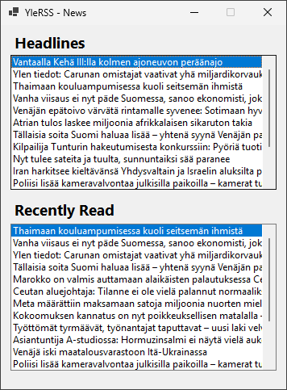
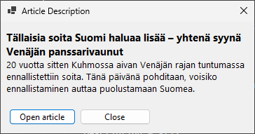
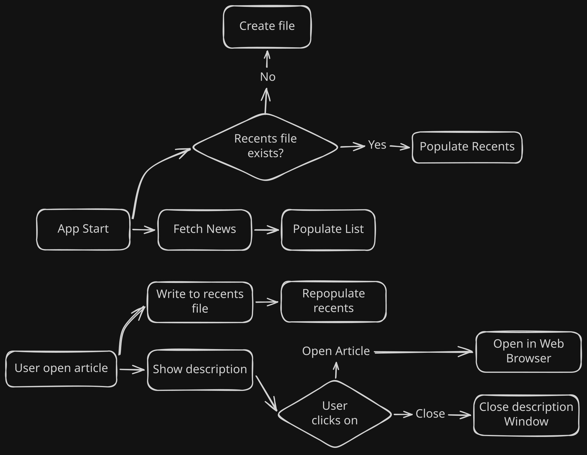

# YleRSS
Small program made by Niko for a school assignment.
## What is this?
Small program that fetches the Yle RSS feed for news, and displays them in a neat list in a WinForms project. You can click on any of the news and it will bring up a little description with a link to open the article. It also saves the recently viewed news in a seperate list with a limit of 50 articles for viewing later.

---




## Architecture


### Code infrastructure
XML library is used in parsing the RSS feed. HTTP requests are made using the `HttpClient` and a custom user agent since Yle's RRS feed does not allow any generic user agent.
```csharp
// YLE RSS returns 403 forbidden if we don't have a user agent, this was AI generated
client.DefaultRequestHeaders.UserAgent.ParseAdd("Mozilla/5.0 (Windows NT 10.0; Win64; x64)");
var xml = await client.GetStringAsync("https://yle.fi/rss/uutiset/paauutiset");
var doc = XDocument.Parse(xml);
```

## Future Ideas
- Article gets written to recents only when the user views it in a Browser.
- Settings to determine how many recent articles to save.
- Better looking UI.
- Viewing the entire article within the app.
